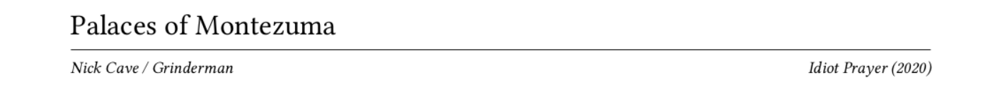
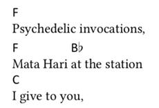
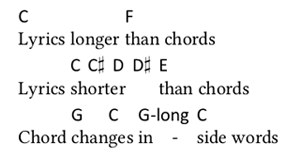
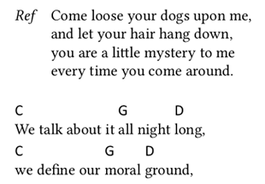
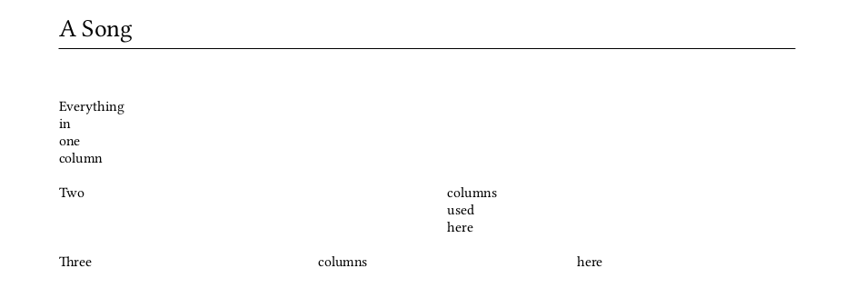

# Songbook
A simple command line tool for creating PDF songbooks from XML documents.

## Contents
- [Getting started](#getting-started)
  - [Building Songbook](#building-songbook)
  - [Usage](#usage)
- [Songbook XML specification](#specifying-the-songbooks-content-in-xml)
  - [Global settings](#global-settings)
  - [Songs](#songs)
    - [Header](#song-header)
    - [Content](#song-content): [chords](#chords), [lines](#lines), [verses](#verse-chorus), [multiple columns](#multiple-columns)
    - [Entities](#entities)
  

## Getting started
### Prerequisities
This app is implemented in C++ and can be build using [CMake](https://cmake.org/) and a build system and C++ compiler of your choice. [Xerces-C++](https://xerces.apache.org/xerces-c/) is used for XML parsing and has to be installed separately. To produce the final PDF, [XeTeX](https://xetex.sourceforge.net/) has to be installed.

### Building Songbook
To build using e.g. the [Ninja](https://ninja-build.org/) build system you can run:
```bash
mkdir build
cd build
cmake -GNinja ..
cmake --build .
```
C++ documentation can be found [here](https://danekpavel.github.io/songbook/index.html).

#### Troubleshooting
If Xerces is installed and still isn't located by CMake, its installation path has to be specified in the first `cmake` command, e.g.:
```bash
cmake -DCMAKE_PREFIX_PATH=C\:/Program\ Files\ \(x86\)/xerces-c/ -GNinja ..
```

### Usage
To produce a PDF ([sb.pdf](data/sb.pdf)) from the provided [sb.xml](data/sb.xml) file, use:
```bash
cd data
../build/songbook/songbook.exe -pdf2 sb.xml
```
The Songbook program will first translate the XML file to a LaTeX source file ([sb.tex](data/sb.tex)) and then call `xelatex` to produce the final PDF songbook ([sb.pdf](data/sb.pdf)). For this to work, `xelatex` has to be available to Songbook.

#### Full usage
```
songbook [options] <input_xml_file>
Options:
  -l <file>     Save LaTeX source code to <file>. Standard output is used when
                output file is not specified and '-pdf[2]' is not used.
  -pdf          Run XeLaTeX to produce a PDF. xelatex must be installed and
                available to the program. PDF file name is based on the LaTeX
                file name. If '-l' was not used, LaTeX file name is derived
                from the XML file name by removing the '.xml' extension (when
                present) and adding the '.tex' extension.
  -pdf2         Run XeLaTeX twice to properly generate the table of contents.
                See '-pdf' for other details. Only one of '-pdf'/'-pdf2' can be
                used.
```

#### Troubleshooting
On Windows, the `libxerces-c.dll` library has to be available to the program either through the PATH environment variable or by copying it from Xerces installation to the location of `songbook.exe`.

## Specifying the songbook's content in XML
See [sb.xml](data/sb.xml) for an example Sonbgook XML. It starts with optional [global settings](#global-settings) followed by the [songs](#songs):
```xml
<songbook>
  <settings>
    <!-- global settings -->
  </settings>
  <songs>
    <song>
        <!-- song content -->
    </song>
    <!-- further songs -->
  </songs>
</songbook>
```
Detailed description of the songbook XML structure can be found in its [XML Schema](data/songbookSchema.xsd).

### Global settings
Several properties of the resulting document can be specified:

Element name|Content type|Description|Default
---|---|---|---
language|text|language which will determine the way songs are sorted by name; it should be a locale recognized on the current system (e.g., *en* or *cs_CZ*) and, generally, [IETF language tags](https://en.wikipedia.org/wiki/IETF_language_tag) should work; can also be a semicolon-separated list of locales of which the first one available on the system will be used|cs
sortSongs|`yes`/`no`|should songs be sorted by their name?|yes
chorusLabel|text|label used for chorus|Ref
tocTitle|text|title for the table of contents (list of songs) page|Obsah
mainFont|text|font used for everything except chord names|Linux Libertine O
chordFont|text|font used for chord names|Calibri
entities|[see here](#user-defined-entities)|user-defined entities|*none*

To produce an English songbook, the defaults can be modified like this:
```xml
<settings>
  <language>en</language>
  <chorusLabel>Chorus</chorusLabel>
  <tocTitle>Contents</tocTitle>
</settings>
```

### Songs
A song consists of its header, directly followed by the elements of its content:
```xml
<song>
  <header>
    <!-- header elements -->
  </header>
  <!-- content -->
  <verse/>
  <line/>
  <!-- etc. -->
</song>
```

#### Song header
Several elements can appear inside song header (`<name>` is mandatory):

Element|Description
---|---
name|song name
sortingName|song name used for sorting
author/authors|either single `<author>` element or several `<author>` elements inside an `<authors>` element
album|album name
year|release year

Individual authors from `<authors>` will be separated by slashes in the final songbook PDF. For example, this header specification
```xml
<header>
  <name>Palaces of Montezuma</name>
  <authors>
    <author>Nick Cave</author>
    <author>Grinderman</author>
  </authors>
  <album>Idiot Prayer</album>
  <year>2020</year>
</header>
```
will result in a header like this:


#### Song content
The main building block of a song is a [line](#line). It can contain lyrics, [chords](#chord) or both. Typically, lines form a verse or a chorus:
```xml
<verse>
  <line><chord root="F"/>Psychedelic invocations,</line>
  <line><chord root="F"/>Mata Hari <chord root="Bb"/>at the station
  <line><chord root="C"/>I give to you,</line>
</verse>
```


#### Chords
`<chord>` represents one chord and is an attribute-only element with three possible attributes (root is mandatory):
Attribute|Description|Value
---|---|---
root|root note of the chord|letters `A`&ndash;`H` in uoper or lower case, optionally followed by a pitch modifier (`#` or `b`); alternatively, `special` can be used in which case only the `type` attribute of the chord is used
type|chord type|any string indicating chord type, e.g., `m`, `maj7` or `dim`
bass|bass note of the chord|same as root
optional|specifies if the chord is optional|`yes`/`no`

Chord root and type are put together, bass note is added after a slash and if the chord is marked as optional, the result is surrounded with parentheses. So e.g., `<chord root="C#" type="maj7" bass="G#" optional="yes"/>` will result in `(C#maj7/G#)`.

#### Lines
When both chords and lyrics are present, chords are placed above lyrics and each chord (or a group of chords with no lyrics between them) is left-aligned with the lyrics that immediately follow it. Note that **some spaces matter**. When a chord is not separated from the preceding lyrics by a space, the chord change is considered to appear inside a word and if the chord's width exceeds that of the preceding lyrics, a hyphen will be inserted in the resulting gap in lyrics:

```xml
<verse>
  <line><chord root="C"/>Lyrics longer <chord root="F"/>than chords</line>
  <line>Lyrics <chord root="C"/><chord root="C#"/><chord root="D"/><chord root="D#"/>shorter <chord root="E"/>than chords</line>
  <line>Chord <chord root="G"/>chan<chord root="C"/>ges <chord root="G" type="-long"/>in<chord root="C"/>side words</line>
</verse>
```


#### Verse, chorus
Verses and choruses are represented by the `<verse>` and `<chorus>` elements, respectively. While a verse is just a series of lines, a chorus is left-indented so that the chorus label (see `chorusLabel` in [global settings](#global-settings)) can be placed to the left of it:
```xml
<chorus>
<line>Come loose your dogs upon me,</line>
<line>and let your hair hang down,</line>
<line>you are a little mystery to me</line>
<line>every time you come around.</line>
</chorus>

<verse>
<line><chord root="C"/>We talk about it <chord root="G"/>all night <chord root="D"/>long,</line>
<line><chord root="C"/>we define our <chord root="G"/>moral <chord root="D"/>ground,</line>
</verse>
```


An empty chorus element (`<chorus/>`) prints just the chorus label.

#### Multiple columns
Parts of a song can be put in multiple columns using the `<multicols>` element with an optional attribute `number` which specifies the number of columns (default is 2). Column breaks are either automatic or can be forced using the `<columnbreak/>` element:
```xml
<song>
<header>
  <name>A Song</name>
</header>

<line>Everything</line>
<line>in</line>
<line>one</line>
<line>column</line>

<multicols>
<line>Two</line>
<columnbreak/>
<line>columns</line>
<line>used</line>
<line>here</line>
</multicols>

<multicols number="3">
<line>Three</line>
<line>columns</line>
<line>here</line>
</multicols>
</song>
```


The `<multicols>` element can only appear as a direct child of `<song>`.

### Entities
#### Default entities
Several XML entities can be used:

Entity|Description|Value
---|---|---
`&nbsp;`|non-breakable space|
`&thinsp;`|thin space|
`&ndash;`|en dash|–
`&mdash;`|em dash|—
`&hellip;`|ellipsis|...
`&ampersand;`|ampersand|&
`&times;`|times symbol|×
`&quoteEnglishOpen;`|English opening quotation mark|“
`&quoteEnglishClose;`|English closing quotation mark|”
`&quoteCzechOpen;`|Czech opening quotation mark|„
`&quoteCzechClose;`|Czech closing quotation mark|“

#### User-defined entities
Additional XML entities can be defined inside the `<settings>` element, e.g.

```xml
<settings>
  <entities>
    <entity>
      <name>threetimes</name>
      <value>&times;&times;&times;</value>
    </entity>
  </entities>
</settings>
```

defines an entity `&threetimes;` which translates to "×××". Note that while default entities can be used to define user entities (with the exception of `&ampersand;`), user entities cannot.
 